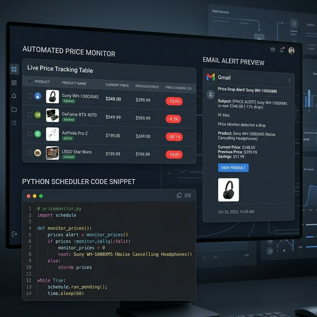

# Competitor Price Tracking System

An automated price monitoring engine that tracks competitor products 24/7 and sends real-time email alerts the moment prices drop.

✔ Protects your profit margins by guaranteeing you never miss a competitor's discount
✔ Completely bypasses expensive SaaS tracking tools with a lightweight, self-hosted script
✔ Provides actionable pricing intelligence via built-in historical CSV trend logging

## Use Cases
- **E-commerce Retailers:** Automatically track rival stores and adjust your own pricing the moment they launch a sale.
- **Dropshippers:** Monitor your suppliers' costs and get notified instantly if wholesale prices change.
- **Market Research:** Build a long-term historical database of pricing trends across multiple industry websites.

## Project Structure

```
price-monitor-alert/
├── monitor.py              # Core monitoring logic
├── targets.example.json    # Example targets config
├── requirements.txt
└── .env.example
```

## Setup

```bash
pip install -r requirements.txt
cp .env.example .env
cp targets.example.json targets.json
# Edit .env and targets.json
```

## Target Configuration (`targets.json`)

```json
[
  {
    "name": "Product Name",
    "url": "https://example.com/product",
    "price_selector": ".price",
    "threshold_pct": 5.0
  }
]
```

| Field | Description |
|---|---|
| `name` | Display name for alerts and logs |
| `url` | Product page URL |
| `price_selector` | CSS selector for the price element |
| `threshold_pct` | Minimum drop % to trigger an alert |

## Usage

```bash
python monitor.py
```

The monitor runs a check immediately on startup, then repeats every `CHECK_INTERVAL_HOURS` (default: 1 hour).

## Example Alert Email

```
Subject: Price Drop Alert: Example Book — 12.3% off

Price drop detected!

Product: Example Book
URL: https://example.com/product

Previous price: GBP 51.77
Current price:  GBP 45.43
Drop: 12.3%

Checked at: 2024-05-15T10:00:00+00:00
```

## Price History CSV

```csv
name,url,price,currency,checked_at
Example Book,https://...,51.77,GBP,2024-05-15T09:00:00+00:00
Example Book,https://...,45.43,GBP,2024-05-15T10:00:00+00:00
```

## Tech Stack

`httpx` · `beautifulsoup4` · `apscheduler` · `python-dotenv`

## Screenshot



